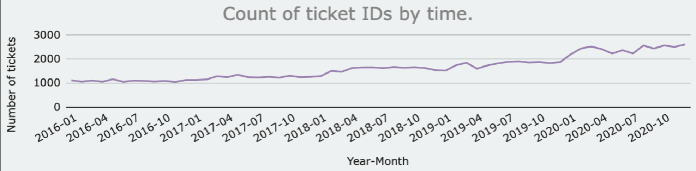
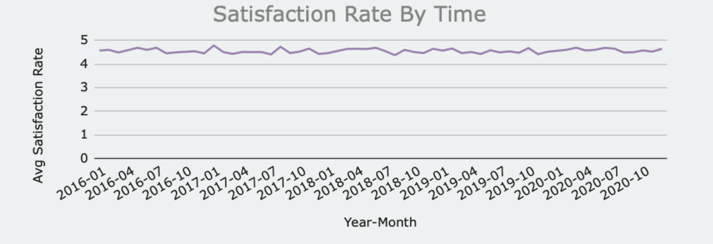
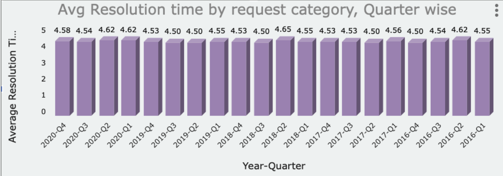

# 📊 IT Service Desk Analytics


## Optimizing IT Support Operations Through Data-Driven Decision Making

An end-to-end **Business Intelligence & Data Analytics** case study analyzing **97,498 IT support tickets** to uncover operational bottlenecks, evaluate service performance, and recommend strategic initiatives that improve efficiency, scalability, and customer satisfaction using **Microsoft Excel**.

---

## 📊 Executive Dashboard

<p align="center">
  
</p>

---

# 🚀 Project Highlights

- 📊 Analyzed **97,498 IT support tickets** spanning **five years (2016–2020)**
- 📈 Built an interactive executive dashboard in **Microsoft Excel**
- 📉 Designed **10+ business KPIs** to evaluate operational performance
- 🔍 Identified service bottlenecks using exploratory data analysis
- 👥 Evaluated performance across **50 IT support agents**
- 💡 Developed strategic recommendations for technology investment, workforce optimization, and process improvement
- 📑 Delivered findings through a business presentation and analytical report

---

# 📌 Results at a Glance

| Metric | Value |
|---------|------:|
| 📄 Total Tickets | **97,498** |
| 📅 Analysis Period | **2016–2020** |
| 👨‍💻 IT Support Agents | **50** |
| 🗂 Request Categories | **4** |
| 📊 Operational KPIs | **10+** |
| 🛠 Primary Tool | **Microsoft Excel** |
| 🎯 Objective | Improve IT Service Operations |

---

# 🎯 Project Snapshot

| Attribute | Details |
|-----------|---------|
| **Role** | Data Analyst |
| **Project Type** | Business Intelligence Case Study |
| **Duration** | 4 Weeks |
| **Industry** | IT Service Management |
| **Primary Tool** | Microsoft Excel |
| **Dataset Size** | 97,498 IT Support Tickets |
| **Deliverables** | Interactive Dashboard, Business Report, Business Presentation |

---

# 📖 Table of Contents

- [Executive Summary](#-executive-summary)
- [Business Problem](#-business-problem)
- [Objectives](#-objectives)
- [Repository Structure](#-repository-structure)
- [Dataset Overview](#-dataset-overview)
- [Business Questions Answered](#-business-questions-answered)
- [Data Cleaning & Preparation](#-data-cleaning--preparation)
- [Tools & Techniques](#-tools--techniques)
- [Analytical Methodology](#-analytical-methodology)
- [Dashboard](#-dashboard)
- [Key Performance Indicators](#-key-performance-indicators-kpis)
- [Key Business Insights](#-key-business-insights)
- [Strategic Recommendations](#-strategic-recommendations)
- [Estimated Business Impact](#-estimated-business-impact)
- [Challenges Faced](#-challenges-faced)
- [Key Learnings](#-key-learnings)
- [Skills Demonstrated](#-skills-demonstrated)
- [Project Deliverables](#-project-deliverables)
- [Future Improvements](#-future-improvements)
- [About This Project](#-about-this-project)
- [Connect With Me](#-connect-with-me)

---

# 📋 Executive Summary

Efficient IT support is essential for maintaining business continuity, employee productivity, and service quality. As organizations grow, increasing ticket volumes place greater pressure on support teams to resolve issues quickly while maintaining a positive customer experience.

This project analyzes **97,498 IT support tickets** collected between **2016 and 2020** to evaluate service desk performance, identify operational bottlenecks, and uncover opportunities for process optimization.

Using **Microsoft Excel**, the project covers the complete analytics lifecycle—from data cleaning and exploratory data analysis (EDA) to KPI development, dashboard design, and executive reporting.

Rather than focusing solely on visualization, the analysis emphasizes **data-driven decision-making**, translating operational data into practical business recommendations that support long-term efficiency and scalability.

---

# 🎯 Business Problem

As ticket volumes continue to increase, IT leaders must determine the most effective way to improve service performance. Expanding the workforce is one option, but investments in employee capability, automation, or process improvements may deliver greater long-term value.

This analysis addresses the following business questions:

- Should the organization hire additional IT support agents?
- Which request categories create the largest operational bottlenecks?
- Would technology investments deliver greater benefits than increasing headcount?
- Which agents consistently outperform or underperform?
- How has service performance evolved over time?
- Which KPIs should management monitor to support better decision-making?

---

# 🎯 Objectives

The primary objectives of this project are to:

- Analyze historical IT service desk operations
- Measure performance using business-focused KPIs
- Identify recurring operational bottlenecks
- Evaluate IT agent productivity and efficiency
- Analyze customer satisfaction trends
- Build an interactive executive dashboard
- Generate data-driven business recommendations
- Demonstrate how analytics supports strategic decision-making

---

# 📁 Repository Structure

```text
IT-Service-Desk-Analytics
│
├── 📄 README.md
├── 📂 data/
│   ├── 📄 Raw_Data.xlsx
│   └── 📄 Cleaned_Data.xlsx
├── 📂 presentation/
│   └── 📑 Business_Presentation.pdf
├── 📂 report/
│   └── 📘 Project_Report.pdf
└── 📂 images/
    ├── 🖼 executive-dashboard.png
    ├── 🖼 kpi-cards.png
    ├── 🖼 ticket-trend.png
    ├── 🖼 resolution-category.png
    └── 🖼 satisfaction-trend.png
```

> **Note:** Folder names may vary slightly depending on the repository structure.

---

# 📊 Dataset Overview

The analysis is based on historical IT service desk records covering support operations over a five-year period.

| Metric | Value |
|---------|------:|
| Total Tickets | **97,498** |
| Analysis Period | **2016–2020** |
| IT Support Agents | **50** |
| Request Categories | **4** |
| Priority Levels | **4** |
| Severity Levels | **5** |

## Request Categories

- 🔐 Login Access
- 💻 System
- 🖥 Software
- ⚙ Hardware

Each ticket contains operational information such as:

- Ticket Date
- Assigned IT Agent
- Employee ID
- Request Category
- Issue Type
- Resolution Time
- Customer Satisfaction Rating
- Priority Level
- Severity Level

---

# 💼 Business Questions Answered

This analysis was designed to answer practical questions faced by IT managers when evaluating operational performance and allocating resources.

| Business Question | Business Objective |
|-------------------|--------------------|
| Should additional IT support agents be hired? | Determine whether workload or process inefficiencies drive longer resolution times. |
| Which request category creates the biggest bottleneck? | Identify opportunities for process improvement or automation. |
| Would technology investments outperform workforce expansion? | Evaluate the highest-impact improvement strategy. |
| Which agents consistently outperform or underperform? | Support performance management and targeted coaching. |
| How have ticket volume and service performance changed over time? | Understand long-term operational trends. |
| Which KPIs should leadership monitor regularly? | Establish measurable indicators for continuous improvement. |


# 🧹 Data Cleaning & Preparation

Reliable insights begin with reliable data. Before performing any analysis, the dataset underwent cleaning and preprocessing to improve consistency, accuracy, and usability.

## Data Cleaning Activities

✔ Standardized inconsistent text values

✔ Removed unnecessary whitespace and formatting issues

✔ Corrected invalid and incomplete records

✔ Created calculated helper columns

✔ Extracted employee email domains

✔ Calculated employee age from date of birth

✔ Categorized employees into age groups

✔ Merged ticket and IT agent information using lookup functions

✔ Created calculated fields for KPI reporting

✔ Validated outputs using Pivot Tables and summary checks

---

## Excel Functions Utilized

| Function | Purpose |
|----------|---------|
| **VLOOKUP** | Merge ticket and IT agent information |
| **DATEDIF** | Calculate employee age |
| **FIND** | Locate character positions within text |
| **MID** | Extract portions of text strings |
| **TRIM** | Remove unnecessary spaces |
| **COUNTIF** | Count records matching specific conditions |
| **AVERAGEIFS** | Calculate conditional averages |
| **CORREL** | Measure relationships between variables |
| **ROUND** | Standardize numerical outputs |

---

# 🛠 Tools & Techniques

## Microsoft Excel

This project was completed entirely in **Microsoft Excel**, using its built-in capabilities for data preparation, analysis, visualization, and dashboard development.

### Data Preparation

- Data Cleaning
- Data Validation
- Feature Engineering
- Lookup Functions
- Data Transformation

### Data Analysis

- Exploratory Data Analysis (EDA)
- Trend Analysis
- Correlation Analysis
- Time-Series Analysis
- Operational KPI Analysis

### Visualization

- Pivot Tables
- Pivot Charts
- KPI Cards
- Interactive Dashboard
- Executive Reporting

### Business Intelligence

- Business Analytics
- Decision Support
- Data Storytelling
- Performance Reporting
- Executive Dashboard Design

---

# 🧠 Analytical Methodology

The project follows a structured analytics workflow that transforms raw operational data into actionable business insights.

```text
Business Understanding
        │
        ▼
Data Collection
        │
        ▼
Data Cleaning & Validation
        │
        ▼
Feature Engineering
        │
        ▼
Exploratory Data Analysis
        │
        ▼
KPI Development
        │
        ▼
Dashboard Design
        │
        ▼
Business Insights
        │
        ▼
Strategic Recommendations
```

---

# 🔄 Project Workflow

```text
Raw Data
   │
   ▼
Data Cleaning
   │
   ▼
Feature Engineering
   │
   ▼
Exploratory Data Analysis
   │
   ▼
KPI Development
   │
   ▼
Interactive Dashboard
   │
   ▼
Business Insights
   │
   ▼
Strategic Recommendations
```

---

# 📈 Key Performance Indicators (KPIs)

The dashboard was designed around business-focused KPIs that help management evaluate operational efficiency, monitor service quality, and identify opportunities for continuous improvement.

| KPI | Business Purpose |
|------|------------------|
| Average Resolution Time | Measure operational efficiency |
| Average Satisfaction Rating | Evaluate customer experience |
| Total Ticket Volume | Monitor service demand |
| Tickets per Agent | Assess workload distribution |
| Resolution Time by Category | Identify operational bottlenecks |
| Resolution Time by Priority | Evaluate urgency management |
| Resolution Time by Severity | Measure handling efficiency |
| Agent Performance | Compare productivity across agents |
| Ticket Growth Trend | Understand long-term demand |
| Customer Satisfaction Trend | Monitor service quality over time |

---

# 📊 Dashboard

The executive dashboard provides a centralized view of operational performance, enabling stakeholders to monitor service metrics, identify trends, and make data-driven decisions.

## Dashboard Capabilities

- Monitor ticket volume trends
- Evaluate service efficiency
- Compare request categories
- Track customer satisfaction
- Assess workload distribution
- Analyze priority and severity levels
- Support strategic planning through interactive reporting

---

## 📸 KPI Dashboard Preview

<p align="center">
  
</p>

The dashboard is organized around executive KPIs, allowing managers to evaluate overall service performance at a glance.

---

# 📌 Dashboard Features

The dashboard includes:

- 📊 Executive KPI Cards
- 📈 Ticket Volume Trend Analysis
- ⏱ Resolution Time Monitoring
- 😊 Customer Satisfaction Tracking
- ⚙ Request Category Analysis
- 👥 IT Agent Performance Evaluation
- 🚨 Priority & Severity Distribution
- 📌 Interactive Slicers for Dynamic Filtering
- 📑 Executive-Friendly Business Reporting


# 💡 Key Business Insights

The analysis uncovered several operational trends that can help management improve efficiency, allocate resources effectively, and maintain high service quality as support demand continues to grow.

---

# 📈 1. Ticket Demand Increased Significantly Over Time

Ticket volume more than doubled between **2016 and 2020**, reflecting sustained growth in IT support demand. Despite this increase, the organization maintained relatively stable service quality, indicating that the existing support team adapted well to rising workloads.

### 📊 Supporting Analysis

<p align="center">
  
</p>

### Business Implication

If ticket demand continues to grow at a similar pace, operational processes should be optimized before expanding the workforce. Investing in automation and workflow improvements can help the organization scale more efficiently while maintaining service quality.

---

# 😊 2. Customer Satisfaction Remained Consistently High

Customer satisfaction remained above **4 out of 5** throughout the analysis period, suggesting that the IT support team consistently delivered a positive service experience despite increasing ticket volumes.

### 📊 Supporting Analysis

<p align="center">
  
</p>

### Business Implication

Maintaining high customer satisfaction while demand increases demonstrates strong operational performance. Future initiatives should focus on preserving this service quality while reducing average resolution times.

---

# ⚙️ 3. Hardware Requests Represent the Largest Operational Bottleneck

Although Hardware requests account for a relatively small share of total tickets, they require the **longest average resolution time (7.63 days)**. This suggests that these requests are more complex and may be affected by inventory constraints, procurement delays, or specialized technical requirements.

### 📊 Supporting Analysis

<p align="center">
  
</p>

### Business Implication

Reducing hardware resolution time presents one of the greatest opportunities for improving overall operational efficiency.

Potential improvement initiatives include:

- Improved spare inventory management
- Standardized diagnostic procedures
- Better escalation workflows
- Enhanced technician specialization

---

# 🔐 4. Login Access Requests Demonstrate the Benefits of Automation

Login Access requests have an average resolution time of only **0.31 days**, making them the fastest request category in the dataset.

Their standardized and repetitive nature makes them ideal candidates for automation and self-service solutions.

### Business Implication

Expanding automation to similar low-complexity request categories could significantly reduce manual workload while improving response times.

Potential initiatives include:

- Password self-service portals
- Automated account provisioning
- AI-powered virtual assistants
- Intelligent ticket routing

---

# 👥 5. Performance Differences Are Driven More by Capability Than Workload

Agent workloads appear relatively balanced across the support team. However, meaningful differences exist in average resolution times, suggesting that performance variation is influenced more by technical capability, experience, and troubleshooting approach than by ticket volume alone.

### Business Implication

Rather than immediately increasing staffing levels, targeted coaching and knowledge-sharing initiatives are likely to deliver greater operational improvements.

Recommended actions include:

- Technical mentoring programs
- Internal knowledge-sharing sessions
- Standardized troubleshooting documentation
- Performance benchmarking

---

# 📊 6. KPI Monitoring Enables Proactive Decision-Making

The dashboard demonstrates that operational performance can be effectively monitored through a focused set of KPIs rather than relying on individual ticket reviews.

Tracking these metrics consistently enables management to identify issues early, allocate resources effectively, and make informed strategic decisions.

Recommended KPIs include:

- Average Resolution Time
- Tickets per Agent
- SLA Compliance
- Customer Satisfaction
- First Contact Resolution
- Ticket Backlog
- Ticket Growth Rate

---

# 🎯 Strategic Recommendations

Based on the analysis, the following recommendations are prioritized according to their expected business impact.

## 🥇 Priority 1 — Modernize the Ticket Management Process

Invest in technology that reduces manual effort and improves workflow efficiency.

Recommended initiatives include:

- Intelligent ticket routing
- Automated ticket categorization
- AI-assisted ticket triage
- Integrated knowledge base
- Self-service support portal
- Chatbot-assisted issue resolution

### Expected Benefits

- Faster ticket assignment
- Reduced manual workload
- Improved consistency
- Better scalability
- Lower operational costs

---

## 🥈 Priority 2 — Strengthen Agent Capability

Performance differences suggest that employee development may generate greater improvements than immediate workforce expansion.

Recommended initiatives include:

- Targeted technical training
- Coaching for lower-performing agents
- Internal knowledge-sharing sessions
- Standardized troubleshooting procedures
- Cross-functional mentoring

### Expected Benefits

- Reduced average resolution time
- More consistent service quality
- Higher First Contact Resolution
- Increased employee productivity

---

## 🥉 Priority 3 — Establish Continuous KPI Monitoring

Develop a structured performance management process using operational dashboards.

Recommended KPIs include:

- Resolution Time
- Customer Satisfaction
- Tickets per Agent
- SLA Compliance
- Backlog Volume
- Ticket Growth

### Expected Benefits

- Earlier identification of operational issues
- Improved decision-making
- Better resource planning
- Continuous performance improvement

---

## 🏅 Priority 4 — Expand Workforce Strategically

Additional hiring should be considered only after workflow optimization and technology improvements have been implemented.

This ensures staffing investments address genuine capacity constraints rather than underlying process inefficiencies.

---

# 📈 Estimated Business Impact

If the recommended initiatives are implemented successfully, the organization can reasonably expect improvements in the following areas:

| Area | Expected Outcome |
|------|------------------|
| Operational Efficiency | Reduced ticket resolution time |
| Productivity | Higher tickets resolved per agent |
| Customer Experience | Improved satisfaction and service consistency |
| Scalability | Better ability to manage increasing ticket volumes |
| Cost Efficiency | Reduced manual effort and operational overhead |
| Decision-Making | Improved visibility into service performance |

> **Note:** These represent expected business outcomes based on the analysis and should be validated through implementation and ongoing KPI monitoring.

---

# 🚧 Challenges Faced

Like many real-world analytics projects, this analysis required overcoming several data and reporting challenges.

Key challenges included:

- Cleaning inconsistent categorical values
- Resolving formatting inconsistencies
- Designing meaningful executive KPIs
- Balancing analytical depth with dashboard simplicity
- Translating operational metrics into actionable business recommendations

Addressing these challenges improved both the reliability of the analysis and the usability of the final dashboard.

---

# 📚 Key Learnings

This project strengthened both technical and business analytics capabilities by demonstrating how operational data can support strategic decision-making.

Key takeaways include:

- Translating business problems into measurable analytical objectives
- Cleaning and preparing operational datasets for analysis
- Designing executive dashboards for decision-makers
- Building business-focused KPIs
- Converting analytical findings into actionable recommendations
- Communicating insights through effective data storytelling
- Applying Microsoft Excel as a Business Intelligence tool rather than simply a spreadsheet application


# 🛠 Skills Demonstrated

This project demonstrates a combination of technical, analytical, and business skills commonly expected in Data Analyst and Business Intelligence roles.

---

## 💻 Technical Skills


- Microsoft Excel
- Dashboard Design
- Pivot Tables
- Pivot Charts
- Lookup Functions
- Data Validation
- Conditional Formatting
- Feature Engineering

---

## 📊 Analytical Skills


- Data Cleaning
- Exploratory Data Analysis (EDA)
- KPI Development
- Trend Analysis
- Time-Series Analysis
- Correlation Analysis
- Performance Analysis
- Operational Analytics

---

## 💼 Business Skills


- Business Intelligence
- Business Problem Solving
- Data Storytelling
- Decision Support
- Executive Reporting
- Process Improvement
- Strategic Recommendations

---

# 📦 Project Deliverables

This repository contains the complete set of deliverables produced during the analysis.

| Deliverable | Description |
|--------------|-------------|
| 📊 Interactive Dashboard | Executive Excel dashboard for monitoring IT support performance |
| 📄 Business Report | Detailed documentation covering methodology, analysis, and recommendations |
| 📑 Business Presentation | Executive presentation summarizing key findings |
| 📁 Dataset | Raw and cleaned datasets used throughout the project |
| 📖 README | Complete project documentation and business case study |

---

# 🚀 Future Improvements

Although this project was completed entirely in Microsoft Excel, it can be extended using more advanced Business Intelligence and Data Analytics tools.

## 📈 Business Intelligence

- Rebuild the dashboard using **Power BI**
- Create executive scorecards
- Automate KPI reporting

## 🗄 Data Engineering

- Automate data preparation using **Power Query**
- Integrate SQL for scalable data extraction
- Develop a reusable ETL workflow

## 🤖 Advanced Analytics

- Forecast future ticket volumes
- Predict staffing requirements
- Build SLA compliance dashboards
- Detect operational anomalies

## 🧠 Machine Learning

- Predict ticket resolution time
- Classify incoming support requests
- Recommend ticket priorities
- Develop intelligent ticket-routing models

---

# 🌟 Why This Project Matters

Organizations often respond to increasing support demand by hiring more staff. However, operational data frequently reveals that improving processes, strengthening employee capability, and investing in technology can deliver greater long-term value.

This project demonstrates how Business Intelligence can transform operational data into actionable insights that support strategic decision-making rather than simply reporting historical performance.

---

# 📖 About This Project

This project reflects my approach to analytics:

> **Understand the business problem → Prepare reliable data → Analyze performance → Generate actionable insights → Support better business decisions.**

Beyond building dashboards, the focus of this project is on solving business problems through structured analysis, effective communication, and data-driven recommendations.

---

# 🤝 Connect With Me

Thank you for taking the time to explore this project.

If you'd like to discuss Data Analytics, Business Intelligence, or potential collaboration opportunities, feel free to connect.

### 👤 Kartik Singh

[](https://www.linkedin.com/in/kartik-singh-54854a216)

[](https://substack.com/@kainsrt)

---

# ⭐ Support This Project

If you found this project helpful or interesting:

- ⭐ Star this repository
- 🍴 Fork it to explore or build upon it
- 💼 Connect with me on LinkedIn
- 📚 Explore my other analytics projects

Your feedback and suggestions are always welcome.

---

<p align="center">
Built with ❤️ using <strong>Microsoft Excel</strong><br>
Designed as a Business Intelligence & Data Analytics Portfolio Project
</p>
