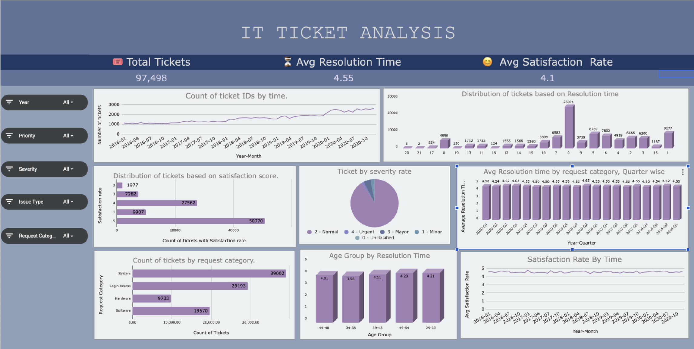

# 📊 IT Service Desk Analytics


## Optimizing IT Support Operations Through Data-Driven Decision Making

An end-to-end **Business Intelligence & Data Analytics** case study analyzing **97,498 IT support tickets** to uncover operational bottlenecks, evaluate service performance, and recommend strategic initiatives that improve efficiency, scalability, and customer satisfaction using **Microsoft Excel**.

---

# 📸 Executive Dashboard

> **📷 Insert Screenshot 1 here (Most Important Image)**

**What to capture**

- The complete dashboard
- All KPI cards visible
- Charts visible
- Filters/Slicers visible
- Export as PNG with the highest resolution possible

Save the image as:

```
images/executive-dashboard.png
```

```markdown

```

---

# 🚀 Project Highlights

- 📊 Analyzed **97,498 IT support tickets** spanning **5 years (2016–2020)**
- 📈 Built an interactive executive dashboard in **Microsoft Excel**
- 📉 Developed **10+ operational KPIs** for performance monitoring
- 🔍 Identified process bottlenecks through exploratory data analysis
- 👥 Evaluated service performance across **50 IT support agents**
- 💡 Delivered strategic recommendations for technology investment, workforce optimization, and process improvement
- 📑 Presented findings through executive reporting and business storytelling

---

# 📌 Results at a Glance

| Metric | Value |
|---------|------:|
| 📄 Total Tickets | **97,498** |
| 📅 Analysis Period | **2016–2020** |
| 👨‍💻 IT Support Agents | **50** |
| 🗂 Request Categories | **4** |
| 📊 Operational KPIs | **10+** |
| 📈 Dashboard Type | Executive Dashboard |
| 🛠 Tool Used | Microsoft Excel |
| 🎯 Primary Goal | Improve IT Service Operations |

---

# 📖 Table of Contents

- [Executive Summary](#-executive-summary)
- [Business Problem](#-business-problem)
- [Objectives](#-objectives)
- [Repository Structure](#-repository-structure)
- [Dataset Overview](#-dataset-overview)
- [Business Questions Answered](#-business-questions-answered)
- [Data Cleaning & Preparation](#-data-cleaning--preparation)
- [Tools & Techniques](#-tools--techniques)
- [Analytical Methodology](#-analytical-methodology)
- [Dashboard](#-dashboard)
- [Key Performance Indicators](#-key-performance-indicators-kpis)
- [Key Business Insights](#-key-business-insights)
- [Strategic Recommendations](#-strategic-recommendations)
- [Estimated Business Impact](#-estimated-business-impact)
- [Challenges Faced](#-challenges-faced)
- [Key Learnings](#-key-learnings)
- [Skills Demonstrated](#-skills-demonstrated)
- [Deliverables](#-deliverables)
- [Future Improvements](#-future-improvements)
- [About This Project](#-about-this-project)
- [Author](#-author)

---

# 📋 Executive Summary

Efficient IT support is critical to maintaining business continuity, employee productivity, and service quality. As organizations grow, increasing ticket volumes place greater pressure on IT teams to resolve issues quickly while maintaining high customer satisfaction.

This project analyzes **97,498 IT support tickets** collected over a five-year period (2016–2020) to evaluate operational performance, identify inefficiencies, and uncover opportunities for process optimization.

Using **Microsoft Excel**, I performed data cleaning, exploratory data analysis (EDA), KPI development, dashboard design, and business intelligence reporting to transform raw operational data into actionable insights.

Rather than focusing solely on dashboard creation, this project emphasizes **data-driven decision-making** by answering key business questions, identifying operational bottlenecks, and recommending strategic improvements that enhance IT service delivery.

---

# 🎯 Business Problem

The organization's IT department is experiencing sustained growth in support requests while striving to maintain fast response times and high customer satisfaction. Management needs to understand whether future investments should focus on expanding the workforce, improving employee capabilities, or modernizing operational processes.

This project addresses the following strategic challenges:

- Should the organization hire additional IT support agents?
- Would targeted employee training improve service performance?
- Is investing in better ticket management technology the highest-value opportunity?
- Which request categories contribute most to operational bottlenecks?
- Which performance metrics should management monitor regularly?
- How has IT support performance evolved over time?

---

# 🎯 Objectives

The primary objectives of this analysis were to:

- Analyze historical IT service desk operations
- Measure operational performance using business KPIs
- Identify recurring operational bottlenecks
- Evaluate IT agent productivity and efficiency
- Analyze customer satisfaction trends
- Develop an interactive executive dashboard
- Generate strategic recommendations backed by data
- Demonstrate how analytics can support operational decision-making

---

# 📁 Repository Structure

```
IT-Service-Desk-Analytics
│
├── README.md
├── dashboard/
│   └── IT_Service_Desk_Dashboard.xlsx
├── presentation/
│   └── Business_Presentation.pdf
├── report/
│   └── Project_Report.pdf
├── dataset/
│   ├── Raw_Data.xlsx
│   └── Cleaned_Data.xlsx
└── images/
    ├── executive-dashboard.png
    ├── dashboard-overview.png
    ├── insights.png
    └── workflow.png
```

> **Note:** Update the filenames above to match the actual files in your repository.

---

# 📊 Dataset Overview

The analysis is based on historical IT service desk records covering support operations over a five-year period.

| Metric | Value |
|---------|------:|
| Total Tickets | **97,498** |
| Analysis Period | **2016–2020** |
| IT Support Agents | **50** |
| Request Categories | **4** |
| Priority Levels | **4** |
| Severity Levels | **5** |

### Request Categories

- 🔐 Login Access
- 💻 System
- 🖥 Software
- ⚙ Hardware

Each ticket includes operational attributes such as:

- Resolution Time
- Customer Satisfaction Rating
- Priority Level
- Severity Level
- Assigned IT Agent
- Employee ID
- Ticket Date
- Request Category
- Issue Type

  # 💼 Business Questions Answered

The analysis was designed to answer practical business questions that IT leaders face when managing support operations and allocating resources.

| Business Question | Objective |
|-------------------|-----------|
| Should the organization hire more IT agents? | Evaluate whether workload or process inefficiencies drive longer resolution times. |
| Which request category creates the biggest operational bottleneck? | Identify categories requiring process improvements or automation. |
| Does investing in technology provide a higher return than increasing headcount? | Assess where operational improvements would have the greatest impact. |
| Which agents consistently outperform or underperform? | Support targeted coaching and performance management initiatives. |
| How have ticket volume and service performance changed over time? | Understand long-term operational trends and scalability requirements. |
| Which KPIs should management monitor continuously? | Define measurable indicators for operational excellence and informed decision-making. |

---

# 🧹 Data Cleaning & Preparation

Reliable insights depend on high-quality data. Before performing any analysis, the dataset underwent extensive cleaning and preprocessing to ensure consistency, accuracy, and usability.

### Data Cleaning Activities

✔ Standardized inconsistent text values

✔ Removed unnecessary whitespace and formatting issues

✔ Corrected invalid and incomplete records

✔ Created calculated helper columns

✔ Extracted employee email domains

✔ Calculated employee age from date of birth

✔ Categorized employees into age groups

✔ Joined ticket records with IT agent information using lookup functions

✔ Created calculated fields for KPI reporting

✔ Validated formulas and summarized results using Pivot Tables

---

### Excel Functions Utilized

| Function | Purpose |
|----------|---------|
| VLOOKUP | Merge ticket and agent information |
| DATEDIF | Calculate employee age |
| FIND | Locate character positions within text |
| MID | Extract portions of text strings |
| TRIM | Remove unnecessary spaces |
| COUNTIF | Aggregate records matching specific conditions |
| AVERAGEIFS | Calculate conditional averages |
| CORREL | Measure relationships between variables |
| ROUND | Standardize numerical outputs |

---

# 🛠 Tools & Techniques

## Primary Tool

- Microsoft Excel

## Data Preparation

- Data Cleaning
- Data Validation
- Feature Engineering
- Lookup Functions
- Data Transformation

## Data Analysis

- Exploratory Data Analysis (EDA)
- Trend Analysis
- Correlation Analysis
- Operational KPI Analysis
- Time-Series Analysis

## Visualization

- Pivot Charts
- Pivot Tables
- KPI Cards
- Interactive Slicers
- Executive Dashboard Design

## Business Intelligence

- Performance Reporting
- Operational Analytics
- Executive Reporting
- Business Storytelling
- Decision Support

---

# 🧠 Analytical Methodology

This project follows a structured analytics workflow that transforms raw operational data into actionable business insights.

```
Business Understanding
        │
        ▼
Data Collection
        │
        ▼
Data Cleaning & Validation
        │
        ▼
Feature Engineering
        │
        ▼
Exploratory Data Analysis
        │
        ▼
KPI Development
        │
        ▼
Dashboard Design
        │
        ▼
Business Insights
        │
        ▼
Strategic Recommendations
```

---

# 🔄 Analytical Workflow

The project followed the following end-to-end workflow:

Raw Data

⬇

Data Cleaning

⬇

Feature Engineering

⬇

Exploratory Data Analysis (EDA)

⬇

KPI Development

⬇

Interactive Dashboard

⬇

Business Insights

⬇

Strategic Recommendations

---

# 📈 Key Performance Indicators (KPIs)

The dashboard was designed around business-focused KPIs that help management evaluate operational efficiency and monitor service quality.

| KPI | Business Purpose |
|------|------------------|
| Average Resolution Time | Measure operational efficiency |
| Average Satisfaction Rating | Evaluate customer experience |
| Total Ticket Volume | Monitor service demand |
| Tickets per Agent | Assess workload distribution |
| Resolution Time by Category | Identify process bottlenecks |
| Resolution Time by Priority | Evaluate urgency management |
| Resolution Time by Severity | Measure handling efficiency |
| Agent Performance | Compare productivity across agents |
| Ticket Growth Trend | Understand long-term demand |
| Customer Satisfaction Trend | Monitor service quality over time |

---

# 📊 Dashboard

The executive dashboard consolidates operational KPIs into a single interface, enabling decision-makers to monitor performance, identify trends, and evaluate opportunities for improvement.

The dashboard enables stakeholders to:

- Monitor ticket volume trends
- Evaluate service efficiency
- Compare request categories
- Assess agent performance
- Analyze customer satisfaction
- Review severity and priority distributions
- Support strategic planning through data-driven insights

---

## 📸 Dashboard Overview

> **📷 Insert Screenshot 2 here**

**Recommended file name**

```
images/dashboard-overview.png
```

```markdown

```

This screenshot should display the **entire dashboard**, ideally at full resolution.

---

## 📸 KPI Section

> **📷 Insert Screenshot 3 here**

Focus on:

- KPI Cards
- Resolution Time
- Satisfaction Score
- Ticket Volume
- Any executive summary metrics

Recommended filename

```
images/kpi-cards.png
```

```markdown

```

---

## 📸 Interactive Filters

> **📷 Optional Screenshot 4**

Show:

- Slicers
- Filters
- Dashboard interactivity

Recommended filename

```
images/dashboard-filters.png
```

```markdown

```

---

# 📌 Dashboard Features

The dashboard includes:

- Executive KPI cards
- Interactive slicers for dynamic filtering
- Ticket volume trend analysis
- Resolution time comparisons
- Customer satisfaction tracking
- Request category distribution
- Agent performance evaluation
- Severity and priority analysis
- Executive-friendly visualizations for operational reporting

  # 💡 Key Business Insights

The analysis uncovered several operational trends that can help management improve efficiency, allocate resources more effectively, and maintain high service quality as support demand continues to grow.

---

## 📈 1. Ticket Demand Increased Significantly Over Time

Ticket volume more than doubled between **2016 and 2020**, indicating sustained growth in IT support demand. Despite this increase, the organization maintained relatively stable service quality, demonstrating that the existing support team successfully adapted to rising workloads.

### Business Implication

Continued growth will eventually place pressure on service capacity. Management should proactively improve operational processes before expanding the workforce to ensure long-term scalability.

---

## 😊 2. Customer Satisfaction Remained Consistently High

Customer satisfaction remained above **4 out of 5** throughout the analysis period, suggesting that the IT support team consistently delivered a positive service experience despite increasing ticket volumes.

### Business Implication

Maintaining high satisfaction while demand increases reflects strong operational performance. Future improvement initiatives should focus on preserving this service quality while reducing resolution times.

---

## ⚙️ 3. Hardware Requests Represent the Largest Operational Bottleneck

Although Hardware requests account for a relatively small proportion of total tickets, they require the **longest average resolution time (7.63 days)**. This indicates that these issues are inherently more complex or constrained by operational factors such as inventory availability, procurement delays, or specialized technical expertise.

### Business Implication

Reducing hardware resolution time offers one of the greatest opportunities for improving overall service efficiency.

Potential improvement initiatives include:

- Improved spare inventory management
- Standardized diagnostic procedures
- Better escalation workflows
- Enhanced technician specialization

---

## 🔐 4. Login Access Requests Demonstrate the Benefits of Automation

Login Access requests have an average resolution time of only **0.31 days**, making them the fastest category in the dataset.

The standardized nature of these requests makes them highly suitable for automation and self-service solutions.

### Business Implication

Expanding automation to other repetitive request categories could significantly reduce operational workload while improving response times.

Potential opportunities include:

- Password self-service portals
- Automated account provisioning
- AI-powered virtual assistants
- Intelligent ticket routing

---

## 👥 5. Performance Differences Are Driven More by Capability Than Workload

Agent workloads appear relatively balanced across the support team. However, meaningful differences exist in average resolution times between agents, suggesting that performance variation is influenced more by technical capability, experience, or troubleshooting approach than by ticket volume alone.

### Business Implication

Rather than increasing staffing levels immediately, targeted coaching and knowledge-sharing initiatives are likely to produce greater operational improvements.

Recommended actions include:

- Mentorship programs
- Knowledge base development
- Standardized troubleshooting documentation
- Performance benchmarking

---

## 📊 6. KPI Monitoring Enables Proactive Decision-Making

The dashboard demonstrates that operational performance can be monitored through a focused set of KPIs rather than relying solely on individual ticket reviews.

Tracking these indicators regularly enables management to identify performance issues earlier and respond proactively.

Recommended KPIs include:

- Average Resolution Time
- Tickets per Agent
- SLA Compliance
- Customer Satisfaction
- First Contact Resolution
- Ticket Backlog
- Ticket Growth Rate

---

# 📷 Supporting Insights

> **📷 Insert Screenshot 5 here**

Recommended file name

```
images/insights-trends.png
```

Capture the charts that best support the insights above, such as:

- Ticket Volume Trend
- Resolution Time by Category
- Satisfaction Trend
- Agent Performance Comparison

```markdown

```

---

# 🎯 Strategic Recommendations

Based on the findings, the following recommendations are prioritized according to their expected operational impact.

---

## 🥇 Priority 1 — Modernize the Ticket Management Process

Invest in technology that reduces manual effort and improves workflow efficiency.

Recommended initiatives include:

- Intelligent ticket routing
- Automated ticket categorization
- AI-assisted ticket triage
- Integrated knowledge base
- Self-service support portal
- Chatbot-assisted issue resolution

### Expected Benefits

- Faster ticket assignment
- Reduced manual workload
- Improved consistency
- Better scalability
- Lower operational costs

---

## 🥈 Priority 2 — Strengthen Agent Capability

Performance differences suggest that employee development may generate greater improvements than immediate workforce expansion.

Recommended initiatives:

- Targeted technical training
- Coaching for lower-performing agents
- Internal knowledge-sharing sessions
- Standardized troubleshooting procedures
- Cross-functional mentoring

### Expected Benefits

- Reduced average resolution time
- More consistent service quality
- Higher First Contact Resolution
- Increased employee productivity

---

## 🥉 Priority 3 — Establish Continuous KPI Monitoring

Develop a structured performance management process using operational dashboards.

Recommended KPIs:

- Resolution Time
- Customer Satisfaction
- Tickets per Agent
- SLA Compliance
- Backlog Volume
- Ticket Growth

### Expected Benefits

- Earlier identification of operational issues
- Improved decision-making
- Better resource planning
- Continuous performance improvement

---

## 🏅 Priority 4 — Expand Workforce Strategically

Hiring additional agents should be considered only after workflow optimization and technology improvements have been implemented.

This ensures that staffing investments address genuine capacity constraints rather than underlying process inefficiencies.

---

# 📈 Estimated Business Impact

If the recommended initiatives are successfully implemented, the organization can reasonably expect to achieve improvements such as:

| Area | Expected Outcome |
|------|------------------|
| Operational Efficiency | Reduced ticket resolution time |
| Productivity | Higher tickets resolved per agent |
| Customer Experience | Improved satisfaction and consistency |
| Scalability | Better ability to handle increasing ticket volumes |
| Cost Efficiency | Reduced manual effort and operational overhead |
| Decision-Making | Greater visibility into service performance |

> **Note:** These represent expected business outcomes based on the analysis and should be validated through implementation and ongoing performance monitoring.

---

# 📷 Recommendations & Impact

> **📷 Insert Screenshot 6 here**

Recommended filename

```
images/recommendations.png
```

This image should highlight the charts or KPIs that support your recommendations.

```markdown

```

---

# 🚧 Challenges Faced

Like many real-world analytics projects, this analysis required overcoming several data and reporting challenges.

Key challenges included:

- Cleaning inconsistent categorical values
- Handling formatting inconsistencies across records
- Designing meaningful KPIs for executive reporting
- Balancing analytical depth with dashboard simplicity
- Converting operational metrics into actionable business recommendations

Addressing these challenges improved both the reliability of the analysis and the usability of the final dashboard.

---

# 📚 Key Learnings

This project strengthened both technical and business analytics capabilities by demonstrating how operational data can support strategic decision-making.

Key takeaways include:

- Translating business problems into measurable analytical objectives
- Cleaning and preparing operational datasets for analysis
- Designing executive dashboards for decision-makers
- Building meaningful KPIs aligned with business goals
- Converting analytical findings into actionable recommendations
- Communicating insights through clear data storytelling
- Applying Microsoft Excel as a Business Intelligence tool rather than simply a spreadsheet application

  # 🛠 Skills Demonstrated

This project demonstrates a combination of technical, analytical, and business skills commonly used in Business Intelligence and Data Analytics roles.

## Technical Skills


- Microsoft Excel
- Pivot Tables
- Pivot Charts
- Interactive Dashboards
- Lookup Functions
- Conditional Formatting
- Data Validation
- Feature Engineering

---

## Analytical Skills


- Data Cleaning
- Exploratory Data Analysis (EDA)
- KPI Development
- Trend Analysis
- Correlation Analysis
- Operational Analytics
- Time-Series Analysis
- Performance Analysis

---

## Business Skills


- Business Intelligence
- Executive Reporting
- Data Storytelling
- Decision Support
- Process Improvement
- Strategic Recommendations
- Business Problem Solving

---

# 📦 Project Deliverables

This repository contains multiple deliverables that simulate a real-world business analytics engagement.

| Deliverable | Description |
|--------------|-------------|
| 📊 Interactive Dashboard | Executive Excel dashboard for monitoring IT support operations |
| 📑 Business Presentation | Stakeholder presentation summarizing key findings |
| 📄 Analytical Report | Detailed report covering methodology, analysis, and recommendations |
| 📁 Dataset | Raw and cleaned datasets used during analysis |
| 📈 README | Complete project documentation and business case study |

---

# 🚀 Future Improvements

Potential enhancements that could extend this project include:

### Business Intelligence

- Rebuild the dashboard using **Power BI**
- Develop an executive scorecard for senior management
- Implement automated KPI reporting

### Data Engineering

- Automate data preparation using **Power Query**
- Integrate SQL for scalable data extraction
- Build a reusable ETL workflow

### Advanced Analytics

- Predict future ticket volumes using forecasting models
- Estimate staffing requirements based on demand trends
- Build SLA compliance monitoring dashboards
- Detect operational anomalies using statistical methods

### Machine Learning

- Predict ticket resolution time
- Classify incoming support requests automatically
- Recommend ticket priorities using historical data
- Develop intelligent ticket-routing models

---

# 🌟 Why This Project Matters

Many organizations respond to increasing support demand by hiring additional staff. However, operational data often reveals that process improvements, better technology, and targeted capability development can deliver greater long-term value.

This project demonstrates how business analytics can help organizations move beyond descriptive reporting and make informed strategic decisions using operational data.

Rather than simply presenting dashboards, the analysis focuses on translating data into measurable business outcomes and actionable recommendations.

---

# 📖 About This Project

This project reflects my approach to analytics:

> **Understand the business problem → Prepare reliable data → Measure meaningful KPIs → Generate actionable insights → Support better business decisions.**

Through this case study, I applied Microsoft Excel as a Business Intelligence tool to analyze operational performance, communicate insights effectively, and recommend practical improvements supported by data.

The project emphasizes analytical thinking, business storytelling, and executive reporting—skills that extend beyond dashboard development and are essential for solving real-world business problems.

---

# 🤝 Connect With Me

Thank you for taking the time to explore this project.

If you'd like to discuss Business Intelligence, Data Analytics, or potential collaboration opportunities, feel free to connect with me.

### 👤 Kartik Singh

[](https://www.linkedin.com/in/kartik-singh-54854a216)

[](https://substack.com/@kainsrt)

---

# ⭐ If You Found This Project Helpful

If you enjoyed exploring this project or found the analysis useful:

⭐ Star the repository

🔗 Connect with me on LinkedIn

📚 Explore my other analytics projects

Thank you for visiting!
